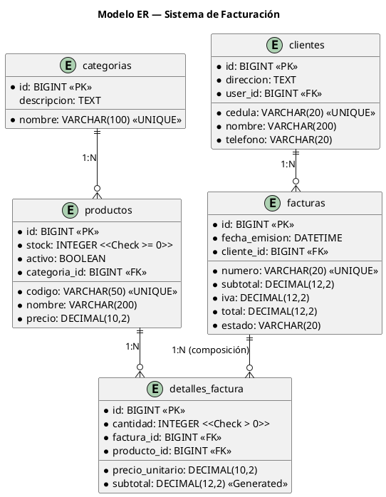

# Caso de Estudio — Análisis y Diseño Orientado a Objetos

> **Sistema de Facturación (Maestro-Detalle)** · Parte 1 de 2
>
> ⏱ **1 – 1.5 horas** · **Asignatura:** Programación Orientada a Objetos (4to curso)

| 📘 Esta guía (Análisis + Diseño) | ➡️ Siguiente |
|---|---|
| **Análisis OO · SOLID · UML · DER** | [Implementación Django](./caso-estudio-facturacion-implementacion.md) |

---

## Tabla de contenido

- [Prerrequisitos](#prerrequisitos)
- [Convenciones del documento](#convenciones-del-documento)
- [Fase 1 — Análisis Orientado a Objetos](#fase-1--análisis-orientado-a-objetos)
- [Fase 2 — Abstracción y Principios SOLID](#fase-2--abstracción-y-principios-solid)
- [Fase 3 — Modelado UML](#fase-3--modelado-uml)
- [Fase 4 — Modelo Entidad-Relación](#fase-4--modelo-entidad-relación)

---

## Prerrequisitos

| Herramienta | Versión | Verificar con |
|---|---|---|
| Python | 3.12.x | `python --version` |
| Git | 2.40+ | `git --version` |
| Navegador | Cualquier moderno | — |
| Editor | VSCode (recomendado) | — |

**Repositorio:** `D:\UNEMI\2026\PERIODO-ABRIL-JUNIO\POO\POO-4TO-CURSO-DJANGO-POSTGRES-REACT`

**Conocimientos previos:** leer la [Referencia del Framework Django](./referencias-django.md) — secciones 1 a 6 (MVT, ORM, Models, Views). No necesita código funcionando, solo entender los conceptos.

---

## Convenciones del documento

| Símbolo | Significado |
|---|---|
| `📄 **`ruta`**` | Archivo PlantUML a crear |
| `💡 **Concepto POO:**` | Principio de POO aplicado en este paso |
| `✅ **Checkpoint:**` | Verificación obligatoria antes de continuar |
| `| ⬅️ | 📘 | ➡️ |` | Navegación entre documentos |

---

## Fase 1 — Análisis Orientado a Objetos

### 1.1 Descripción del problema

**Comercial "El Porvenir"** es una tienda de abastos que necesita un sistema de facturación para modernizar sus operaciones. Actualmente llevan sus ventas en cuadernos y han empezado a tener problemas con el control de inventario, el cálculo de impuestos y la gestión de créditos.

#### Proceso de negocio actual

Doña María, la dueña, atiende a sus clientes así:

1. El cliente llega y pide uno o varios productos (ej: 3 gaseosas, 2 panes, 1 leche).
2. Doña María consulta en su cuaderno si hay suficiente **stock** de cada producto en la bodega.
3. Si hay, anota en una hoja: el **nombre** del cliente, la **fecha**, qué productos llevó, **cuántos** de cada uno, y a **qué precio** los vendió.
4. Al final del día suma todo a mano: **subtotal** (suma de precio × cantidad), **IVA** (15 % del subtotal) y **total** (subtotal + IVA).
5. Si un cliente ya tiene deuda, no le vende más hasta que pague.
6. A veces un cliente devuelve productos y ella debe anular la venta y devolver los productos al estante.

#### Entidades que emergen del proceso

Del relato anterior, un analista OO identifica estas **entidades del mundo real**:

| Entidad | ¿Qué es? | Atributos que se mencionan |
|---|---|---|
| **Categoria** | Clasificación de productos (gaseosas, lácteos, panes) | nombre, descripción |
| **Producto** | Cada ítem que se vende en la tienda | código, nombre, precio de venta, stock disponible |
| **Cliente** | Persona que compra en la tienda | cédula/RUC, nombre, teléfono, dirección |
| **Factura** | Comprobante de la venta (el **maestro**) | número único, fecha de emisión, subtotal, IVA, total, estado (pendiente/pagada/anulada) |
| **DetalleFactura** | Cada línea dentro de la factura (el **detalle**) | qué producto, cuántas unidades, precio unitario, subtotal de la línea |

#### Relaciones entre entidades

Estas entidades no están aisladas. Del proceso se deducen las siguientes relaciones:

- Una **Categoría** puede tener muchos **Productos** (ej: "Bebidas" tiene gaseosas, aguas, jugos). Un **Producto** pertenece a una sola Categoría.
- Un **Cliente** puede emitir muchas **Facturas** a lo largo del tiempo. Cada **Factura** pertenece a un solo Cliente.
- Una **Factura** contiene **1 o más DetallesFactura** (nunca cero). Cada **DetalleFactura** pertenece a una sola Factura. Si la Factura se elimina, los detalles también — **composición**.
- Un **Producto** puede aparecer en muchos **DetallesFactura** (en distintas facturas). Cada **DetalleFactura** refiere a un solo Producto.

#### Reglas de negocio

Del proceso se extraen estas reglas que el sistema debe cumplir:

| # | Regla | ¿Por qué? |
|---|---|---|
| R1 | No se puede vender un producto si su stock es menor a la cantidad solicitada | Evita prometer lo que no hay |
| R2 | Al crear una factura, el stock de cada producto debe disminuir automáticamente | El inventario debe reflejar la venta |
| R3 | subtotal = Σ (precio_unitario × cantidad) de todas las líneas | Es la suma de los subtotales de cada detalle |
| R4 | IVA = subtotal × 15 % | Tasa de impuesto vigente |
| R5 | total = subtotal + IVA | Monto final que paga el cliente |
| R6 | Al anular una factura, el stock debe devolverse al estante | Consistencia del inventario |
| R7 | Una factura anulada no se puede volver a anular | Evita duplicidad de devolución |
| R8 | El número de factura debe ser secuencial y único (FAC-000001, FAC-000002, ...) | Control fiscal y legal |

### 1.2 Identificación de clases (desde el dominio)

Del proceso descrito en 1.1, extraemos formalmente las **5 clases del dominio**. Cada una tiene una responsabilidad única y sus atributos son los que aparecen en el relato de Doña María:

| Clase | Surge de | Responsabilidad (SRP) | Atributos clave |
|---|---|---|---|
| `Categoria` | "gaseosas, lácteos, panes" | Clasificar productos | nombre, descripción |
| `Producto` | "3 gaseosas, 2 panes, 1 leche" | Representar un ítem vendible | código, nombre, precio, stock, ¿activo? |
| `Cliente` | "el cliente", "nombre del cliente" | Datos del comprador | cédula, nombre, teléfono, dirección |
| `Factura` | "anota en una hoja" — el **maestro** | Transacción comercial | número, fecha, subtotal, IVA, total, estado |
| `DetalleFactura` | "qué productos, cuántos, a qué precio" — el **detalle** | Línea de la factura | producto, cantidad, precio unitario, subtotal |

> 💡 **Maestro-Detalle:** `Factura` es el **Maestro** (un comprobante). `DetalleFactura` es el **Detalle** (las líneas dentro del comprobante). Un maestro puede tener cero o muchos detalles, pero un detalle no existe sin su maestro. Esta es una relación de **composición** en UML y se traduce como `ForeignKey` con `on_delete=models.CASCADE` en Django.

### 1.3 Relaciones (del proceso al modelo)

Cada relación del diagrama tiene su origen en una frase del proceso de negocio:

| Frase de Doña María | Relación UML | Cardinalidad |
|---|---|---|
| *"Las gaseosas están en la categoría Bebidas"* | `Categoria` → `Producto` | 1:N (una categoría, muchos productos) |
| *"Juan Pérez ya debe facturas del mes pasado"* | `Cliente` → `Factura` | 1:N (un cliente, muchas facturas) |
| *"En esta factura llevó 3 gaseosas y 2 panes"* | `Factura` → `DetalleFactura` | **1:N composición** (la factura contiene N líneas) |
| *"La gaseosa está en varias facturas"* | `Producto` → `DetalleFactura` | 1:N (un producto aparece en muchas facturas) |

### 1.4 Requisitos funcionales (mapeo RF → reglas de negocio)

| # | Requisito | Regla de negocio que lo origina |
|---|---|---|
| RF-01 | CRUD de categorías | *Doña María quiere clasificar sus productos* |
| RF-02 | CRUD de productos con stock inicial | *Necesita registrar qué vende y cuánto tiene* |
| RF-03 | CRUD de clientes | *Necesita saber quién le compra* |
| RF-04 | Crear factura con N líneas de detalle **(transaccional)** | **R1+R2+R3+R4+R5** — stock, cálculos, persistencia en una sola operación |
| RF-05 | Listar facturas por cliente y filtrar por estado | *"Necesito ver las cuentas de Juan"* |
| RF-06 | Anular factura y restaurar stock | **R6+R7** — devolución + control de doble anulación |
| RF-07 | Calcular subtotal, IVA y total automáticamente | **R3+R4+R5** — que la máquina haga las sumas |
| RF-08 | No permitir venta si stock es insuficiente | **R1** — *"No le vendo más si no hay en bodega"* |

✅ **Checkpoint Fase 1:** ¿Puede explicarle el sistema a Doña María usando solo las 5 clases y las 8 reglas de negocio?

---

## Fase 2 — Abstracción y Principios SOLID

### SRP — Responsabilidad Única

| Clase | Una sola razón para cambiar |
|---|---|
| `Categoria` | Si cambia la forma de clasificar productos |
| `Producto` | Si cambian los atributos del producto |
| `Cliente` | Si cambian los datos del comprador |
| `Factura` | Si cambia la estructura del comprobante |
| `DetalleFactura` | Si cambia el formato de las líneas |
| `FacturaService` | Si cambia la lógica de facturación (no los modelos) |

### OCP — Abierto/Cerrado

Las clases del modelo están **cerradas para modificación** pero **abiertas para extensión**:

```python
# Nuevo tipo de producto SIN modificar Producto:
class ProductoDigital(Producto):
    enlace_descarga = models.URLField()
```

### LSP — Sustitución de Liskov

Cualquier subclase de `Producto` puede reemplazar a `Producto` en `DetalleFactura.producto` (es `ForeignKey` a `Producto`, acepta subclases).

### ISP — Segregación de Interfaces

Separamos en servicios pequeños en lugar de una clase "todopoderosa":

| Servicio | Solo hace |
|---|---|
| `FacturaService` | Crear/anular facturas |
| `InventarioService` (opcional) | Solo operaciones de stock |

### DIP — Inversión de Dependencias

La vista (`InvoiceCreateView`) depende de `FacturaService` (una abstracción), NO del modelo `Factura` directamente:

```python
# BIEN (DIP):
class InvoiceCreateView(LoginRequiredMixin, View):
    def post(self, request):
        factura = FacturaService.crear(...)  # abstracción
        ...

# MAL (sin DIP):
class InvoiceCreateView(LoginRequiredMixin, View):
    def post(self, request):
        factura = Factura.objects.create(...)  # acoplado al modelo
```

✅ **Checkpoint Fase 2:** Sin código aún. Los conceptos SOLID deben estar claros antes de implementar.

---

## Fase 3 — Modelado UML

### 3.1 Diagrama de clases

📄 **`docs/uml/05-clases-facturacion.puml`**

Muestra las 5 clases del dominio + `FacturaService` + excepciones. Incluye:
- Composición `Factura` → `DetalleFactura` (rombo relleno)
- Asociación `Cliente` → `Factura`, `Producto` → `DetalleFactura`
- Dependencia `FacturaService` → modelos
- Jerarquía de excepciones (`StockInsuficienteError`, `FacturaAnuladaError`)

### 3.2 Diagrama de secuencia — Crear factura

📄 **`docs/uml/06-secuencia-factura.puml`**

Muestra el flujo transaccional optimizado con `F()`:
1. Llega `POST /api/v1/facturas/` con cliente_id + detalles[]
2. Por cada detalle: `UPDATE producto SET stock=stock-N WHERE stock>=N` (atómico)
3. Si `updated=0` → error + rollback
4. Calcular IVA, subtotal, total
5. `Factura.objects.create()` + `DetalleFactura.objects.bulk_create()`
6. Commit → 201 Created

### 3.3 Diagrama de despliegue

Ídem [`docs/uml/03-despliegue.puml`](./guia-laboratorio-03.md#13-diagrama-de-despliegue). Solo cambia que el servidor Django tiene 4 apps en lugar de 2.

✅ **Checkpoint Fase 3:** Los 3 archivos `.puml` existen y renderizan con PlantUML (extensión de VSCode o `Alt+D`).

---

## Fase 4 — Modelo Entidad-Relación

📄 **`docs/uml/07-er-facturacion.puml`**



✅ **Checkpoint Fase 4:** Identifique PK, FK y constraints (`UNIQUE`, `Check`, `Generated`) en cada tabla.

---

➡️ **Continuar con:** [Implementación Django (Parte 2)](./caso-estudio-facturacion-implementacion.md)

En la Parte 2 llevará estas 5 clases y 8 reglas de negocio a código Django funcional: modelos, servicios transaccionales, vistas CBV con `ListView`/`CreateView`/`UpdateView`, templates Bootstrap 5 y pruebas.
