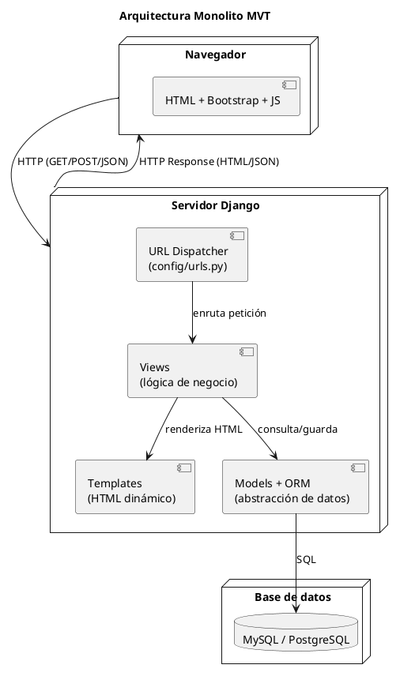
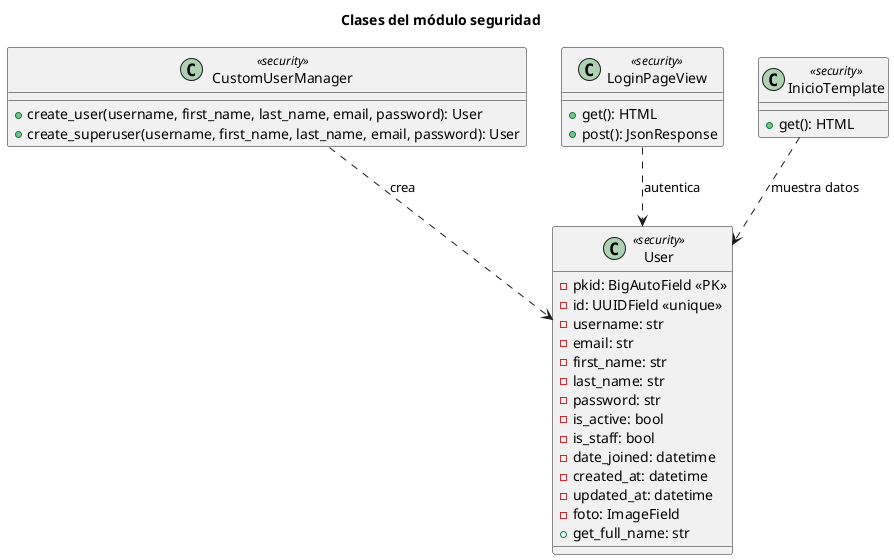
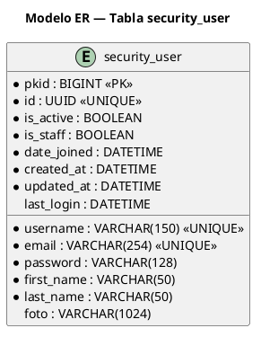
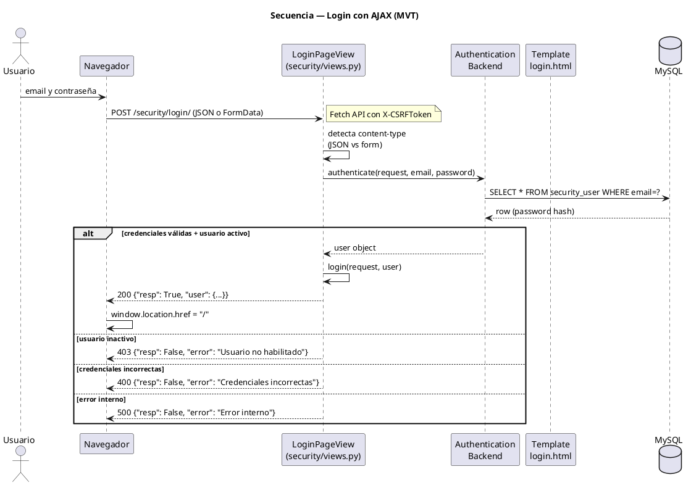

# Guía de Laboratorio 03 — Diagramas UML del Sistema

> **Parte 3** · ⏱ **45 min – 1 hora**
> **Prerrequisito:** [Parte 2](./guia-laboratorio-02.md) completada (módulo seguridad funcional).
> **Alcance:** diagramas UML del sistema de autenticación.

| ⬅️ Anterior | 📘 Esta guía | ➡️ Siguiente |
|---|---|---|
| [02 — Módulo Seguridad](./guia-laboratorio-02.md) | **03** UML | [**03b — Login Profesional**](./guia-laboratorio-03b.md) |

---

## 1. Fase 8 — Diagramas UML (PlantUML)

> 💡 **Concepto POO:** un diagrama UML captura la estructura (clases) y el comportamiento (secuencia) del sistema.

### 1.1 Instalar PlantUML en VSCode

`Ctrl + Shift + X` → busque **PlantUML** (jebbs) → instale. Previsualizar: `Alt + D` con el `.puml` abierto.

### 1.2 Crear archivos

En `docs/uml/` cree 4 archivos vacíos:

```
docs/uml/
├── 03-despliegue.puml
├── 03-clases-seguridad.puml
├── 03-er-auth.puml
└── 03-secuencia-login.puml
```

### 1.3 Diagrama de despliegue

📄 **`docs/uml/03-despliegue.puml`**



### 1.4 Diagrama de clases

📄 **`docs/uml/03-clases-seguridad.puml`**



### 1.5 Modelo ER

📄 **`docs/uml/03-er-auth.puml`**



### 1.6 Diagrama de secuencia (login)

📄 **`docs/uml/03-secuencia-login.puml`**



✅ **Checkpoint:** 4 diagramas renderizan sin errores (Alt+D en VSCode).

---

## 2. Verificación final

```bash
cd "D:/UNEMI/2026/PERIODO-ABRIL-JUNIO/POO/POO-4TO-CURSO-DJANGO-POSTGRES-REACT/backend"
source .venv/Scripts/activate
python manage.py runserver
```

| # | Criterio | ✅ |
|---|---|---|
| 1 | `python manage.py check` sin errores | ☐ |
| 2 | `showmigrations` todo `[X]` | ☐ |
| 3 | Admin en `/admin/` muestra User con foto | ☐ |
| 4 | Login en `/security/login/` con AJAX (email+pass) | ☐ |
| 5 | Login exitoso redirige a `/` (home) | ☐ |
| 6 | Home `/` muestra nombre completo y email | ☐ |
| 7 | Logout redirige a `/security/login/` | ☐ |
| 8 | Sin sesión → al visitar `/` redirige a login | ☐ |
| 9 | Error con credenciales inválidas (JS muestra alerta) | ☐ |
| 10 | Diagramas UML renderizan (Alt+D) | ☐ |

---

## Cierre

| Parte | Resultado |
|---|---|
| [01](./guia-laboratorio-01.md) | Django + MySQL (`config/` settings) |
| [02](./guia-laboratorio-02.md) | Módulo seguridad: User personalizado + login AJAX |
| **03** | Diagramas UML del sistema |

### Siguiente paso

Continúa con la [**Guía 03b — Login Profesional**](./guia-laboratorio-03b.md) para mejorar la interfaz de inicio de sesión con Bootstrap 5, Axios y SOLID.
